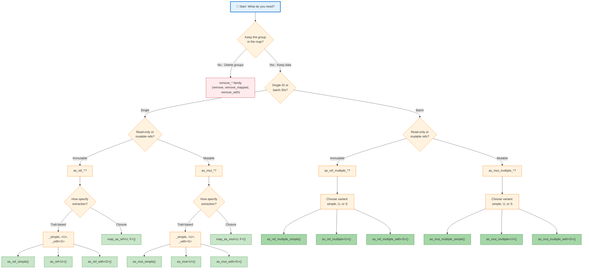

# API Matrix Dimensions

The complete API is organized along **five key dimensions**. Understanding these helps predict which methods exist and why.

### Dimension 1: Operation Family (Prefix)

What operation does the method perform?

| Family | Prefix | Semantics | Use Case |
|--------|--------|-----------|----------|
| **Immutable Read** | `as_ref_*` | Borrow immutably; do not remove | "Give me read-only refs to field values" |
| **Mutable Read** | `as_mut_*` | Borrow mutably; do not remove | "Give me mutable refs to field values for modification" |
| **Owned, non-removing** | `extract_with` / `extract_multiple_with` | Borrow `&mut self`, iterate all `&mut T` via closure, return owned `Vec<U>`; do not remove | "Give me owned extracted values from each field, but leave the groups in place" |
| **Taking** | `take_*` | Remove AND extract field values using `TakeFrom` trait | "Extract field values from these groups, move them out, use configured extractor" |
| **Removing** | `remove_*` | Remove with arbitrary transformation via closure | "Delete these groups, optionally transforming elements via custom closure" |

**Note:** `take_*` and `remove_*` both remove groups but differ in mechanism:
- `take_*` is **extractor-aware**: uses the bound `TakeFrom<G, S>` trait — the extractor is part of the type.
- `remove_*` is **generic transformation**: uses inline closures — no trait configuration needed.

This distinction is intentional. `take_*` is the right choice when you have a configured extractor and want consuming access that mirrors the non-consuming `as_mut_*` path. `remove_*` is the right choice for ad-hoc or closure-driven transformations where no extractor is in scope.

---

### Dimension 2: Cardinality (Single vs. Batch)

Does the method access one discriminant or multiple?

| Cardinality | Name | Parameter | Return Type | Example |
|-------------|------|-----------|-------------|---------| 
| **Single** | (no suffix) | `id: Discriminant<T>` | `Option<Vec<…>>` | `as_mut_simple(id)` |
| **Batch** | `*_multiple` | `ids: &[Discriminant<T>]` | `Map<Discriminant<T>, Vec<…>>` | `as_mut_multiple_simple(ids)` |

**Implication:** Single methods return `Option` (group may not exist); batch methods return a `Map` (always succeeds, missing keys omitted).

### Dimension 3: Extractor Type (Trait vs. Closure)

How does the method specify what to extract?

| Type | Suffix | Trait Used | Flexibility | Example |
|------|--------|-----------|------------|---------|
| **Simple** | `_simple` | `SimpleExtractFrom<T>` | Fixed single output type | `as_mut_simple(id)` |
| **Variant** | `<U>` (type param) | `VariantExtractFrom<T, U>` | Generic variant type U | `as_mut<U>(id)` |
| **Selector** | `_with<S>` | `ExtractFrom<T, S>` with GAT | Arbitrary selector S | `as_mut_with<S>(id)` |
| **Closure** | `map_as_*` or with closure arg | Inline `FnMut` | Complete user control | `map_as_mut(id, \|t\| …)` |

**Principle:** Trait-based variants are pre-configured via the extractor; closure variants let users specify extraction inline. Bound extractors (`SimpleExtractFrom`-based) are only available in methods on `SplitWithExtractor`; `DiscriminantMap` supports generic closures.

### Dimension 4: Lifetime Semantics

How long do returned references live?

| Semantic | Mechanism | Return Type Pattern | Applicable Families | Max Lifetime |
|----------|-----------|-------------|-------------------|-------------------|
| **Shortened** | Reborrow via `&mut self` | `Vec<&'s T>` where `'s = method lifetime` | `as_ref_*`, `as_mut_*` (non-removing) | Tied to method call |
| **Owned, non-removing** | `&mut self` borrow released; owned `U` returned | `Vec<U>` (U is owned) | `extract_with`, `extract_multiple_with` | Unconstrained — `U` has no lifetime borrow |
| **Preserved** | Move via `TakeFrom` trait (G by value) | `Vec<&'a T>` where `'a = original` | `take_*` (removing via trait) | Full original lifetime |
| **Owned, removing** | Move by value (closure or raw) | `Vec<U>` | `remove_*` (removing via closure) | Full original lifetime |

**Why it matters:**
- **Shortened lifetime** (`as_ref_*`, `as_mut_*`): Returned refs can't outlive the map; perfect for interior access.
- **Owned, non-removing** (`extract_with`): Groups stay in the map; only a `Vec<U>` of extracted field values leaves. No lifetime constraint on `U`.
- **Preserved lifetime** (`take_*`): Returned refs can outlive the map; the group is removed first, allowing the `'items` lifetime on `&mut T` elements to flow through.
- **Owned, removing** (`remove_*`): Groups are dropped; owned data is returned. No lifetime constraints.

### Dimension 5: Mutability Requirement

Can the method read its input through immutable borrows, or does it need mutable access?

| Requirement | Trait Bound | Available Families | Example |
|-------------|-------------|-------------------|---------|
| **Immutable only** | `G: Borrow<T>` | `as_ref_*` | `as_ref_simple(id)` |
| **Mutable required** | `G: BorrowMut<T>` | `as_mut_*`, `extract_with`, `extract_multiple_with`, `take_*`, `remove_*` | `as_mut_simple(id)`, `extract_with(id, f)`, `take_simple(id)` |

**Why:**
- `as_ref_*` read through immutable `Borrow<T>` — never need `&mut self`.
- `as_mut_*` and `extract_with` borrow `&mut self` — field access requires a mutable handle.
- `take_*` and `remove_*` structurally modify the map — always need `&mut self`.

---

## Design Decisions (v0.6)

### `take_*` vs `remove_*`: Both retained

`take_*` (4 methods) and `remove_*` (6 methods) both remove groups but differ in mechanism:
- **`take_*`** uses the bound `TakeFrom<G, S>` trait — only available inside a `SplitWithExtractor`. The extractor is part of the type and drives extraction semantics.
- **`remove_*`** uses inline closures — available on both `DiscriminantMap` and `SplitWithExtractor`. No trait configuration needed.

Both families are retained. `take_*` is the natural consuming counterpart of the `as_mut_*` extractor path; `remove_*` is the natural consuming counterpart of `map_as_mut`.

### `extract_with` / `extract_multiple_with`: Non-removing owned-value extraction

These methods fill a gap that neither `as_mut_*` nor `take_*` cover: borrowing mutably, iterating all `&mut T` in a group, and returning **owned** `Vec<U>` values **without removing the group**.

They are closure-based (no extractor trait required) and available on both `DiscriminantMap` and `SplitWithExtractor`. Unlike `take_*`, they do not require `G: BorrowMut<T>` to return references — they give back owned `U` constructed by the closure.

### `GroupMut<'_, G>` and `for_each_group_mut`

`get_mut` returns a `GroupMut<'_, G>` newtype rather than `&mut [G]`. This allows safe iteration, sorting, and positional read access while intentionally omitting `IndexMut`, which would allow silently writing the wrong variant back into a slot. `for_each_group_mut(ids, f)` is the batch counterpart and replaces the former `get_multiple_mut`.

---

Use this flowchart to navigate to the right method for your use case:

### How to Use This Decision Tree

1. **Start** with "What do you need?" — Do you want to keep the data in the map or remove it?
2. **First decision:** If removing, use `remove_*` or `take_*` family; if keeping data in the map, proceed.
3. **Second decision:** If keeping, choose single discriminant or batch
4. **Third decision:** Choose immutable (`as_ref_*`) or mutable (`as_mut_*`) access
5. **Final decision:** Choose how extraction is specified (trait-based with variants, or closure-based)

### Decision Examples

**Example 1: "I need to read field values from one group, immutably"**
- Keep in map? **Yes** → Single or batch? **Single** → Immutable or mutable? **Immutable** → How specify? **Trait** (simple) → **Result: `as_ref_simple(id)`** ✅

**Example 2: "I want to get extracted values from multiple groups and remove them"**
- Keep in map? **No** → **Result: `take_multiple_simple(ids)` or `take_multiple_extracted(ids)`** ✅

**Example 3: "I need batch mutable access with custom selector logic"**
- Keep in map? **Yes** → Single or batch? **Batch** → Immutable or mutable? **Mutable** → **Result: `as_mut_multiple_with<S>(ids)`** ✅

**Example 4: "I want to apply custom closure logic to extract immutably from each group"**
- Keep in map? **Yes** → Single or batch? **Single** → Immutable or mutable? **Immutable** → Trait or closure? **Closure** → **Result: `map_as_ref(id, |t| ...)`** ✅

**Example 5: "I want owned values derived from fields, but I need the groups to stay in the map"**
- Keep in map? **Yes** → Need refs or owned values? **Owned** → **Result: `extract_with(id, |t| ...)` or `extract_multiple_with(ids, |t| ...)`** ✅

**Example 6: "I need to inspect or sort a group in place without extracting field refs"**
- **Result: `get_mut(id)` → `GroupMut<'_, G>`** (iterate, sort, index) ✅
  For multiple groups in one pass: **`for_each_group_mut(ids, |disc, group| ...)`** ✅

---