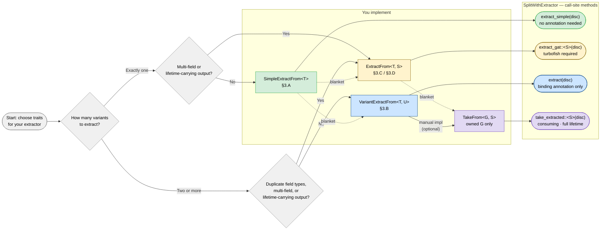

# Four-Crate Pattern: Trait Implementation Guide
---

## 1. The Four Roles in the Pattern

| Role | Who writes it | What it contains |
|---|---|---|
| **Enum crate** | upstream / foreign | The enum type (`IpAddr`, your `Foo`, …) |
| **Factory crate** | you | One extractor ZST + trait impls |
| **Library crate** | this crate | `split_by_discriminant`, `SplitWithExtractor`, all traits |
| **Downstream crate** | your consumers | `split_by_discriminant(...)`, `SplitWithExtractor::new(split, extractor)`, `extractor.extract(disc)` |

The factory crate's sole job is to pick the right trait(s) for each variant so that
downstream callers can use the simplest possible syntax.

---

## 2. Trait Overview

### `SimpleExtractFrom<T>` — associated `Output` type

```rust
pub trait SimpleExtractFrom<T> {
    type Output: 'static;
    fn extract_from<'a>(&self, t: &'a mut T) -> Option<&'a mut Self::Output>;
}
```

- One impl per `(Extractor, T)` pair — the compiler knows the output type without any
  annotation at all.
- Enables `extract_simple(disc)` — **zero annotations, zero turbofish** at the call site.
- Blanket impls provided automatically:
  - `ExtractFrom<T, ()>` → `take_extracted::<()>(disc)` works for free.
  - `VariantExtractFrom<T, Output>` → `extract(disc)` with a binding annotation also works.
- **Do not** also write `ExtractFrom<T, ()>` or `VariantExtractFrom<T, YourOutput>` by hand;
  the blankets fill those slots and a duplicate impl is a compile error.

### `VariantExtractFrom<T, U>` — type-parameter `U`

```rust
pub trait VariantExtractFrom<T, U> {
    fn extract_from<'a>(&self, t: &'a mut T) -> Option<&'a mut U>;
}
```

- One extractor can implement this trait **multiple times** for the same `T`, once per
  distinct field type `U`.
- Enables `ex.extract(disc)` where `U` is inferred from the binding annotation — the
  v0.4 style that downstream callers already know. **No turbofish.**
- Automatically provided for the `SimpleExtractFrom::Output` variant by the blanket above.
- **Do not** implement for `U = <YourExtractor as SimpleExtractFrom<T>>::Output` if
  `SimpleExtractFrom` is already in place; prefer adding it only for additional variants.

### `ExtractFrom<T, Selector>` — GAT `type Output<'a>`

```rust
pub trait ExtractFrom<T, Selector = ()> {
    type Output<'a> where T: 'a;
    fn extract_from<'a>(&self, t: &'a mut T) -> Option<Self::Output<'a>>;
}
```

- The low-level trait. `Output<'a>` is a GAT, so the output may itself contain a lifetime
  (e.g., tuples of `&'a mut _`, or `&'a mut str`).
- Needed when `VariantExtractFrom` cannot represent the output (see §4).
- Enables `ex.extract_gat::<Selector>(disc)` — **turbofish required** at the call site.
- Also enables `ex.take_extracted::<Selector>(disc)` (consuming, full `'items` lifetime)
  via the `TakeFrom` blanket.
- The `()` selector slot is claimed by `SimpleExtractFrom`'s blanket; use a named ZST
  (`pub struct SelectFoo;`) for all other impls.

### `TakeFrom<G, Selector>` — consuming counterpart

```rust
pub trait TakeFrom<G, Selector = ()> {
    type Output;
    fn take_from(&self, g: G) -> Option<Self::Output>;
}
```

- Automatically derived for `G = &mut T` by the blanket over `ExtractFrom<T, S>`. You
  almost never implement this by hand.
- Implement directly only when `G` is an **owned value** (e.g., the result of
  `map_by_discriminant` returning `T` directly) and you want trait-based extraction on it.

---

## 3. Decision Guide: What to Implement

Work through the questions for each extractable variant of your enum.

### Step 1 — Count the variants you need to extract

**Only one variant matters?**
→ Go to §3.A (single-variant extractor).

**Two or more variants?**
→ For each variant, answer Step 2.

---

### Step 2 — Is the field type unique across all extractable variants?

For each variant whose field you want to extract, check whether any other extractable
variant shares the exact same field type.

**All field types are distinct** (the common case)
→ Go to §3.B (multi-variant, distinct types).

**Two or more variants share a field type** (e.g., `A(i32)` and `B(i32)`)
→ Go to §3.D (duplicate field types).

---

### Step 3 — Does any variant need a multi-field or lifetime-carrying output?

**Multi-field (tuple):** The variant carries two or more fields and you want to extract
all of them at once → Go to §3.C.

**Lifetime-carrying field:** The variant carries a type that already contains a borrowed
reference (e.g., a field `&str` or `&[T]`) → Go to §3.C.

---

### §3.A — Single extractable variant

Implement `SimpleExtractFrom<T>`.

```rust
// factory crate
pub struct MyExtractor;

impl SimpleExtractFrom<ForeignEnum> for MyExtractor {
    type Output = FieldType;          // the owned type inside the variant
    fn extract_from<'a>(&self, t: &'a mut ForeignEnum) -> Option<&'a mut FieldType> {
        if let ForeignEnum::TheVariant(v) = t { Some(v) } else { None }
    }
}
```

**Downstream call sites (no turbofish, no annotation):**

```rust
// Fully annotation-free:
let items = ex.extract_simple(disc).unwrap();

// Or with binding annotation (still no turbofish):
let items: Vec<&mut FieldType> = ex.extract_simple(disc).unwrap();
```

The binding annotation is optional because the output type is fully determined by
`SimpleExtractFrom<ForeignEnum>::Output`.

**Also available for free (no extra impl):**
- `ex.take_extracted::<()>(disc)` — consume-and-extract with full `'items` lifetime.
- `ex.extract(disc)` with a binding annotation (via the `VariantExtractFrom` blanket).

---

### §3.B — Multiple variants, all with distinct field types

Implement `VariantExtractFrom<T, U>` **once per variant field type**.

```rust
// factory crate
pub struct MyExtractor;

impl VariantExtractFrom<ForeignEnum, FieldA> for MyExtractor {
    fn extract_from<'a>(&self, t: &'a mut ForeignEnum) -> Option<&'a mut FieldA> {
        if let ForeignEnum::A(v) = t { Some(v) } else { None }
    }
}

impl VariantExtractFrom<ForeignEnum, FieldB> for MyExtractor {
    fn extract_from<'a>(&self, t: &'a mut ForeignEnum) -> Option<&'a mut FieldB> {
        if let ForeignEnum::B(v) = t { Some(v) } else { None }
    }
}
// … one impl per variant
```

**Downstream call sites (binding annotation infers `U`, no turbofish):**

```rust
// U inferred from binding — this is the v0.4 style:
let a_items: Vec<&mut FieldA> = ex.extract(a_disc).unwrap();
let b_items: Vec<&mut FieldB> = ex.extract(b_disc).unwrap();
```

**Tip:** If exactly one of these variants is the "primary" one and you want an even
simpler `extract_simple` path for it, implement `SimpleExtractFrom<T>` for that variant
and then `VariantExtractFrom<T, U>` for all others. The blanket covers the primary
variant's `VariantExtractFrom` automatically; write it manually only for the additional
variants.

```rust
// Optional refinement: one variant gets annotation-free extract_simple, rest use extract()
impl SimpleExtractFrom<ForeignEnum> for MyExtractor {
    type Output = FieldA;  // primary variant
    fn extract_from<'a>(&self, t: &'a mut ForeignEnum) -> Option<&'a mut FieldA> { … }
}

impl VariantExtractFrom<ForeignEnum, FieldB> for MyExtractor { … }
// DO NOT also write VariantExtractFrom<ForeignEnum, FieldA> — that slot is taken by the blanket
```

---

### §3.C — Multi-field output or lifetime-carrying fields

Implement `ExtractFrom<T, Selector>` with a named selector ZST per variant.

```rust
// factory crate
pub struct MyExtractor;
pub struct SelectPair;     // one ZST per distinct output shape
pub struct SelectOther;

impl ExtractFrom<ForeignEnum, SelectPair> for MyExtractor {
    type Output<'a> = (&'a mut i32, &'a mut String);  // tuple, struct, &'a mut str, …
    fn extract_from<'a>(&self, t: &'a mut ForeignEnum) -> Option<Self::Output<'a>> {
        if let ForeignEnum::Pair(n, s) = t { Some((n, s)) } else { None }
    }
}
```

**Downstream call sites (turbofish required for the selector):**

```rust
let pairs: Vec<(&mut i32, &mut String)> = ex.extract_gat::<SelectPair>(disc).unwrap();
```

The binding annotation on the left still helps readability but the `:<SelectPair>`
turbofish cannot be avoided here.

**Adding `VariantExtractFrom` alongside** — if your multi-field variant also has a
single "primary" field that callers often want in isolation, you may implement
`VariantExtractFrom<T, PrimaryField>` in addition to the `ExtractFrom` impl. Both impls
can coexist on the same extractor type without conflict because they are separate traits.

---

### §3.D — Duplicate field types

Two or more variants share the same field type, so `VariantExtractFrom<T, SharedType>`
can only have one impl and cannot distinguish between them.  Use `ExtractFrom<T, S>`
with one selector ZST per variant.

```rust
// e.g. enum E { High(i32), Low(i32), Other }
pub struct SelectHigh;
pub struct SelectLow;

impl ExtractFrom<E, SelectHigh> for MyExtractor {
    type Output<'a> = &'a mut i32;
    fn extract_from<'a>(&self, t: &'a mut E) -> Option<Self::Output<'a>> {
        if let E::High(v) = t { Some(v) } else { None }
    }
}
impl ExtractFrom<E, SelectLow> for MyExtractor {
    type Output<'a> = &'a mut i32;
    fn extract_from<'a>(&self, t: &'a mut E) -> Option<Self::Output<'a>> {
        if let E::Low(v) = t { Some(v) } else { None }
    }
}
```

**Downstream call sites (turbofish unavoidable):**

```rust
let high: Vec<&mut i32> = ex.extract_gat::<SelectHigh>(high_disc).unwrap();
let low:  Vec<&mut i32> = ex.extract_gat::<SelectLow>(low_disc).unwrap();
```

The turbofish is here because the binding type `i32` alone is not enough to choose
between the two impls; the selector provides the missing disambiguation.

---

### §3.E — Closure-based extraction (no trait impl needed)

The `extract_with` method lets you extract without defining an extractor type — just pass
a closure that returns `Option<&'a mut U>`. This is useful when:
- You need a one-off extraction and don't want to define a struct + traits.
- You're in application code (not a factory crate) and don't expect reuse.

**In application code:**

```rust
use split_by_discriminant::split_by_discriminant;
use std::mem::discriminant;

#[derive(Debug)]
enum E { A(i32), B(String), C }

let mut data = vec![E::A(1), E::B("hi".into()), E::A(2), E::C];
let a_disc = discriminant(&E::A(0));

let mut split = split_by_discriminant(&mut data, &[a_disc]);

// No extractor struct needed — closure handles the logic
let ints: Vec<&mut i32> = split.extract_with(a_disc, |e| {
    if let E::A(v) = e { Some(v) } else { None }
}).unwrap();
```

The closure is available on both `DiscriminantMap` and `SplitWithExtractor`, making it
flexible whether or not you have an extractor struct.

---

## 4. The Selector Type Parameter

### What is a Selector?

`ExtractFrom<T, Selector>` and `TakeFrom<G, Selector>` carry a second type parameter
whose sole job is to **give each impl a unique identity on the same extractor type**.
It is never instantiated at runtime — a selector is always a zero-sized type (ZST) that
exists purely as a type-level label.  When you write `ex.extract_gat::<SelectFoo>(disc)`
the `SelectFoo` turbofish tells the compiler which of the potentially many
`ExtractFrom` impls on your extractor to call.

The default selector is `()`.  The `SimpleExtractFrom` blanket claims that slot:

```text
SimpleExtractFrom<T>  →  ExtractFrom<T, ()>   (blanket — () slot is taken)
```

Every other `ExtractFrom` impl on the same extractor for the same `T` must use a
**distinct named ZST** — using `()` again would produce a duplicate impl and fail to
compile.

---

### When `()` is the selector (and you never think about it)

Anytime you implement `SimpleExtractFrom<T>`, the blanket writes `ExtractFrom<T, ()>`
for you.  You can call `take_extracted::<()>(disc)` directly — the `<()>` is the
selector, and it is the shortest possible turbofish:

```rust
impl SimpleExtractFrom<MyEnum> for MyExtractor {
    type Output = i32;
    fn extract_from<'a>(&self, t: &'a mut MyEnum) -> Option<&'a mut i32> {
        if let MyEnum::A(v) = t { Some(v) } else { None }
    }
}

// Downstream — selector is () inferred from take_extracted::<()>:
let ints: Vec<&mut i32> = ex.take_extracted::<()>(disc).unwrap();
```

You never declare `SelectSomething;` anywhere.  The `()` selector is a Rust built-in; no
import is needed.

---

### When a named selector ZST is needed

A named selector must be declared whenever you write more than one `ExtractFrom` impl on
the same extractor type for the same `T`.

**Minimum example — two variants, factory crate:**

```rust
// factory crate  (one file)
pub struct MyExtractor;

pub struct SelectName;   // ZST — no fields, no methods
pub struct SelectScore;  // one per distinct ExtractFrom impl

impl ExtractFrom<Player, SelectName> for MyExtractor {
    type Output<'a> = &'a mut String;
    fn extract_from<'a>(&self, t: &'a mut Player) -> Option<Self::Output<'a>> {
        if let Player::Named { name, .. } = t { Some(name) } else { None }
    }
}

impl ExtractFrom<Player, SelectScore> for MyExtractor {
    type Output<'a> = &'a mut u32;
    fn extract_from<'a>(&self, t: &'a mut Player) -> Option<Self::Output<'a>> {
        if let Player::Named { score, .. } = t { Some(score) } else { None }
    }
}
```

**Downstream crate — must import the selectors, then uses them in turbofish:**

```rust
use factory::{MyExtractor, SelectName, SelectScore};

let names:  Vec<&mut String> = ex.extract_gat::<SelectName>(disc).unwrap();
let scores: Vec<&mut u32>    = ex.extract_gat::<SelectScore>(disc).unwrap();
```

The real cost of named selectors is the import, not the turbofish — once imported,
tab-completion handles the rest.  Factory crates should re-export all selector ZSTs
from their crate root so that one `use factory::*;` or a single named import is enough.

---

### When a selector is utterly unavoidable: duplicate field types

This is the scenario where **no alternative exists at the trait-system level** and a
selector is the only way to proceed.  Consider:

```rust
// foreign / upstream crate
pub enum Priority { High(i32), Medium(i32), Low(i32) }
```

All three variants carry the same field type `i32`.  `VariantExtractFrom<Priority, i32>`
can only have **one impl** on any given extractor — it has no way to distinguish between
`High`, `Medium`, and `Low`.  There is no binding annotation or turbofish that can
rescue it; you simply cannot write three separate `VariantExtractFrom<Priority, i32>`
impls and have the compiler pick between them.

The only solution is `ExtractFrom` with one selector per variant:

```rust
// factory crate
pub struct PriorityExtractor;

pub struct SelectHigh;
pub struct SelectMedium;
pub struct SelectLow;

impl ExtractFrom<Priority, SelectHigh> for PriorityExtractor {
    type Output<'a> = &'a mut i32;
    fn extract_from<'a>(&self, t: &'a mut Priority) -> Option<Self::Output<'a>> {
        if let Priority::High(v) = t { Some(v) } else { None }
    }
}
impl ExtractFrom<Priority, SelectMedium> for PriorityExtractor {
    type Output<'a> = &'a mut i32;
    fn extract_from<'a>(&self, t: &'a mut Priority) -> Option<Self::Output<'a>> {
        if let Priority::Medium(v) = t { Some(v) } else { None }
    }
}
impl ExtractFrom<Priority, SelectLow> for PriorityExtractor {
    type Output<'a> = &'a mut i32;
    fn extract_from<'a>(&self, t: &'a mut Priority) -> Option<Self::Output<'a>> {
        if let Priority::Low(v) = t { Some(v) } else { None }
    }
}
```

**Downstream — turbofish is fully unavoidable:**

```rust
use factory::{PriorityExtractor, SelectHigh, SelectMedium, SelectLow};

let high:   Vec<&mut i32> = ex.extract_gat::<SelectHigh>(high_disc).unwrap();
let medium: Vec<&mut i32> = ex.extract_gat::<SelectMedium>(med_disc).unwrap();
let low:    Vec<&mut i32> = ex.extract_gat::<SelectLow>(low_disc).unwrap();
```

There is no language feature in stable Rust that could disambiguate three impls whose
trait, implementor, and output type are all identical without an extra type parameter.
The selector fills that role by design.

---

### Combining `()` and named selectors on the same extractor

If your extractor implements `SimpleExtractFrom<T>` for a primary variant *and*
`ExtractFrom<T, SelectX>` for additional variants, the `()` slot is occupied by the
blanket and `SelectX` must be a non-`()` ZST:

```rust
impl SimpleExtractFrom<MyEnum> for MyExtractor {
    type Output = i32;         // claims ExtractFrom<MyEnum, ()>
    fn extract_from<'a>(&self, t: &'a mut MyEnum) -> Option<&'a mut i32> { … }
}

pub struct SelectStr;          // must NOT be (); that slot is taken

impl ExtractFrom<MyEnum, SelectStr> for MyExtractor {
    type Output<'a> = &'a mut String;
    fn extract_from<'a>(&self, t: &'a mut MyEnum) -> Option<Self::Output<'a>> { … }
}
```

Call sites:

```rust
// primary variant — annotation-free:
let ints: Vec<&mut i32> = ex.extract_simple(disc_a).unwrap();

// additional variant — turbofish required:
let strs: Vec<&mut String> = ex.extract_gat::<SelectStr>(disc_b).unwrap();

// consuming for primary — minimal turbofish:
let ints: Vec<&mut i32> = ex.take_extracted::<()>(disc_a).unwrap();

// consuming for additional:
let strs: Vec<&mut String> = ex.take_extracted::<SelectStr>(disc_b).unwrap();
```

---

### Selector naming conventions

| Convention | When to use |
|---|---|
| `Select{VariantName}` | Most common; one ZST per variant name |
| `Select{FieldType}` | When the same variant appears across multiple enums handled by one extractor |
| `()` | Reserved for the `SimpleExtractFrom` blanket; never write it manually |

There is no enforced convention — any distinct type works as a selector, including
existing unit structs in your crate.  The only constraint is that the type must be local
to your crate (to satisfy the orphan rule when the impl is on your extractor type).

---

## 5. When Turbofish Is and Is Not Required

| Scenario | Factory crate implements | Downstream call style |
|---|---|---|
| Single extractable variant | `SimpleExtractFrom<T>` | `ex.extract_simple(disc)` — **no annotation at all** |
| Single variant, prefer `extract()` | `SimpleExtractFrom<T>` (blanket fills `VariantExtractFrom`) | `let x: Vec<&mut U> = ex.extract(disc)` — **binding annotation only** |
| Multiple variants, all distinct field types | `VariantExtractFrom<T, U>` per variant | `let x: Vec<&mut U> = ex.extract(disc)` — **binding annotation only** |
| Multi-field output (`(&mut A, &mut B)`) | `ExtractFrom<T, SelectX>` | `ex.extract_gat::<SelectX>(disc)` — **turbofish required** |
| Duplicate field types across variants | `ExtractFrom<T, SelectX>` per variant | `ex.extract_gat::<SelectX>(disc)` — **turbofish required** |
| Lifetime-carrying output (`&'a mut str`, etc.) | `ExtractFrom<T, SelectX>` | `ex.extract_gat::<SelectX>(disc)` — **turbofish required** |

**Summary:** turbofish is mandatory only when the output type cannot be represented as a
plain concrete owned type `U` in `Option<&'a mut U>`, or when two variants share the
same such type.  For all ordinary enums whose variants hold distinct `'static` field
types (`i32`, `String`, `IpAddr`, newtypes, …), the factory crate can implement only
`VariantExtractFrom<T, U>` and downstream callers never need a turbofish.

---

## 6. Consuming Extraction (full `'items` lifetime)

When the extracted references must outlive the `SplitWithExtractor`, use
`take_extracted` instead of `extract`:

| Factory impl | Consuming call | Turbofish |
|---|---|---|
| `SimpleExtractFrom<T>` | `ex.take_extracted::<()>(disc)` | `<()>` required (mild) |
| `VariantExtractFrom<T, U>` only | not available directly | use `split.remove_with(disc, closure)` instead |
| `ExtractFrom<T, SelectX>` | `ex.take_extracted::<SelectX>(disc)` | `<SelectX>` required |

`take_extracted` always requires a turbofish for the selector because the selector is
what connects it to the right `TakeFrom` impl (provided automatically by the `ExtractFrom`
→ `TakeFrom` blanket).

If you implement `VariantExtractFrom` for downstream callers but also want clean
consuming extraction available without a closure, add a matching `ExtractFrom<T, S>` impl
alongside the `VariantExtractFrom` impl — both impls can coexist on the same extractor.

---

## 7. Single Application-Wide Extractor (AppExtractor Pattern)

A single extractor ZST can implement extraction traits for **multiple unrelated enum
types** (`Foo`, `IpAddr`, …) — the orphan rule is satisfied because the impl lives on
your local type, not on the foreign enum.  The library resolves the correct impl at each
call site from the `T` in `SplitWithExtractor<T, …>`.

```rust
pub struct AppExtractor;

// For FooEnum
impl VariantExtractFrom<FooEnum, FieldA> for AppExtractor { … }
impl VariantExtractFrom<FooEnum, FieldB> for AppExtractor { … }

// For BarEnum (completely unrelated T)
impl VariantExtractFrom<BarEnum, FieldX> for AppExtractor { … }
```

Each `SplitWithExtractor<FooEnum, …, AppExtractor>` will only resolve `FooEnum` impls;
each `SplitWithExtractor<BarEnum, …, AppExtractor>` will only resolve `BarEnum` impls.
The compiler never confuses them.

When two enum types have variants with the same concrete field type (e.g., both have an
`i32` field), that creates no conflict because the `T` parameter in
`VariantExtractFrom<T, U>` is different for each enum.

---

## 8. Quick Reference: Trait → Call-site Method Map

| Trait(s) implemented | Reborrow methods | Consuming methods |
|---|---|---|
| `SimpleExtractFrom<T>` | `extract_simple(disc)` · `extract(disc)` | `take_simple(disc)` · `take_extracted::<()>(disc)` |
| `VariantExtractFrom<T, U>` | `extract(disc)` with binding | `remove_with(disc, closure)` |
| `ExtractFrom<T, S>` | `extract_gat::<S>(disc)` | `take_extracted::<S>(disc)` |
| `SimpleExtractFrom<T>` + `VariantExtractFrom<T, U2>` | `extract_simple`, `extract` for both | `take_simple`, `take_extracted::<()>`, `remove_with` for U2 |
| `SimpleExtractFrom<T>` + `ExtractFrom<T, S2>` | `extract_simple`, `extract_gat::<S2>` | `take_simple`, `take_extracted::<()>`, `take_extracted::<S2>` |
| `VariantExtractFrom<T, U>` + `ExtractFrom<T, S>` (same variant) | `extract` + `extract_gat::<S>` | `take_extracted::<S>` |

---

## 9. Blanket Impl Summary

The library ships three blanket impls that reduce boilerplate:

```
SimpleExtractFrom<T>
    → ExtractFrom<T, ()>                    (do not implement manually)
    → VariantExtractFrom<T, Output>         (do not implement manually)

ExtractFrom<T, S>  (where G = &'a mut T)
    → TakeFrom<&'a mut T, S>               (do not implement manually)
```

Only implement `TakeFrom` directly when `G` is an **owned** value (not `&mut T`).

---

## 10. Future Work

The following situations currently require more boilerplate or a turbofish than ideal.
They are noted here for potential improvement in a future release.

### 10.1  `VariantExtractFrom` does not unlock `take_extracted`

`take_extracted::<S>` requires `TakeFrom<G, S>`, which is provided by the
`ExtractFrom<T, S>` → `TakeFrom` blanket.  `VariantExtractFrom<T, U>` has no such
blanket, and one **cannot be added** due to Rust's coherence rules.

The two blankets would have identical structure:

```text
// existing
impl<'a, T, S, E: ExtractFrom<T, S>>        TakeFrom<&'a mut T, S> for E  { … }
// proposed (REJECTED)
impl<'a, T, U, E: VariantExtractFrom<T, U>> TakeFrom<&'a mut T, U> for E  { … }
```

Rust asks: "could some `E` satisfy both `ExtractFrom<T, X>` and
`VariantExtractFrom<T, X>` for the same `X`?"  The answer is yes — nothing prevents
using a field type (e.g. `i32`) as an `ExtractFrom` selector.  The compiler rejects the
pair of blankets at the crate level regardless of user intent.

The cleanest achievable fix is a dedicated `take_variant::<U>` method on
`SplitWithExtractor` that requires `E: VariantExtractFrom<T, U>` and routes through the
already-consumed `G` value (analogous to how `TakeFrom` avoids re-borrowing).  Expressing
"G is a uniquely-owned mutable reference to T" in a generic bound requires either a
new helper trait or a direct `G = &'items mut T` specialisation, neither of which is
possible in stable Rust today.  This remains a known limitation.

### 10.2  ~~`take_extracted` always requires turbofish~~ — **Resolved**

`take_simple(&mut self, id)` has been added to `SplitWithExtractor`.  It requires
`E: SimpleExtractFrom<T>` and `E: TakeFrom<G, ()>` (the latter is satisfied
automatically when `G = &mut T` via the blanket chain), delegates to
`take_extracted::<()>` internally, and exposes no turbofish or annotation at the call
site.  The return type is fully determined by `E` and `T`, identical in ergonomics to
`extract_simple`.

```rust
// Before (turbofish required):
let ints: Vec<&mut i32> = ex.take_extracted::<()>(a_disc).unwrap();

// After (no turbofish, no annotation):
let ints = ex.take_simple(a_disc).unwrap();
```

### 10.3  Mixing `VariantExtractFrom` and `ExtractFrom` for the same variant

If a factory crate wants both the binding-inferred `extract()` ergonomics
(`VariantExtractFrom`) *and* the consuming `take_extracted` ergonomics (`ExtractFrom`)
for the same variant, it currently must implement **both** traits.  The two impls do not
conflict, but the function bodies are identical, which is repetitive.

A blanket `ExtractFrom<T, S> → VariantExtractFrom<T, U>` could eliminate the
duplication, but it is blocked by **three independent coherence problems**:

1. **GAT equality in `where` bounds is unstable.** Constraining
   `for<'a> <E as ExtractFrom<T, S>>::Output<'a> = &'a mut U` requires equating a GAT
   projection with a concrete type inside an HRTB `where` clause.  This is tracked in
   rust-lang/rust#108185 and is not available on stable Rust.

2. **`S` is an ambiguous free variable.** Even if the constraint were expressible, the
   blanket would have the form `impl<E, T, U, S> VariantExtractFrom<T, U> for E where
   E: ExtractFrom<T, S>, …`.  If an extractor has two `ExtractFrom` impls (e.g.
   `SelectA` and `SelectB`) that both happen to produce `&'a mut i32`, the compiler
   cannot decide which `S` to use and rejects the blanket as ambiguous.

3. **Overlap with the `SimpleExtractFrom → VariantExtractFrom` blanket.** Because
   `SimpleExtractFrom<T>` implies `ExtractFrom<T, ()>`, the new blanket would
   generate `VariantExtractFrom<T, Output>` for every `SimpleExtractFrom` implementor
   via a second path — producing duplicate impls that conflict with the blanket already
   in place.

**Current workaround:** implement both traits explicitly (bodies are identical; copy is
mechanical). An IDE or macro can generate the second impl from the first. There is no
stable-Rust solution that avoids the duplication.

### 10.4  Selector ZSTs must be declared in the factory crate

Selector ZSTs (`pub struct SelectFoo;`) must be declared alongside the extractor type.
Downstream callers must import them to use `extract_gat` or `take_extracted`.  This is
correct and unavoidable given Rust's coherence rules — the selector type must be local to
the crate that writes the `ExtractFrom` impl (the factory crate), and downstream callers
must name it.

The import cost is real but manageable.  The following factory crate structure minimises
it:

#### Recommended factory crate layout

```
factory_crate/
  src/
    lib.rs          ← re-exports everything; one import suffices downstream
    extractor.rs    ← extractor struct + all trait impls
    selectors.rs    ← all selector ZSTs, publicly exported
```

**`src/selectors.rs`** — declare all ZSTs in one place:

```rust
// One file; downstream does `use factory_crate::selectors::*` and gets everything.
pub struct SelectName;
pub struct SelectScore;
pub struct SelectPair;
```

**`src/lib.rs`** — re-export both the extractor and all selectors:

```rust
mod extractor;
mod selectors;

pub use extractor::MyExtractor;
pub use selectors::*;          // or name them individually
```

Downstream callers then only need a single import line:

```rust
use factory_crate::{MyExtractor, SelectName, SelectScore};
// or:
use factory_crate::*;   // if the crate re-exports everything at the root
```

#### Alternative: a `prelude` module

For larger factory crates that expose many types, a `prelude` module is idiomatic:

```rust
// factory_crate/src/prelude.rs
pub use crate::extractor::MyExtractor;
pub use crate::selectors::*;
```

Downstream:

```rust
use factory_crate::prelude::*;
```

#### Naming conventions for selector ZSTs

| Pattern | When to use |
|---|---|
| `Select{VariantName}` | Most common; one ZST per variant (`SelectHigh`, `SelectLow`) |
| `Select{FieldDescription}` | When the variant name alone is ambiguous |
| Avoid generic names like `SelectA` | Makes downstream code hard to read at a glance |

The import requirement itself cannot be removed — it is inherent to Rust's coherence
model.  The goal is to reduce it to a single line at the top of each downstream file.

### 10.5  No turbofish-free path for duplicate field types

When two variants share a field type, `VariantExtractFrom` cannot disambiguate them and
`ExtractFrom` with selectors is mandatory.  There is no known way to make this
annotation-free in current Rust without specialisation or associated-type-based
disambiguation that would require breaking changes to the trait design.

---

## 11. Decision Flowchart

Solid arrows show what you implement or what a trait directly unlocks.
Dotted arrows (`-. blanket .->`) mean the library provides that connection automatically — you do nothing.

Node color indicates which decision path leads there.
Green = annotation-free · Blue = binding annotation · Amber = turbofish · Purple = consuming.
Blanket impls (dotted arrows) extend a path's color to additional traits/methods for free.



---

## 12. Implementation Subset → Available Methods

> **Always available** on every `SplitWithExtractor`, regardless of which traits are implemented:
> `get` · `get_mut` · `others` · `remove` · `remove_mapped` · `remove_with` · `remove_others` · `extract_with(closure)` · `into_inner`

The rows below cover the extractable methods that are unlocked by specific trait impls.
`✓` = available · `✗` = not available · `(blanket)` = provided automatically, no extra code · `N` = once per variant/selector

| # | You implement manually | Derived for free (blankets) | `extract_simple` | `extract(disc)` | `extract_gat::<S>(disc)` | `take_extracted::<S>(disc)` | Typical use case |
|---|---|---|:---:|:---:|:---:|:---:|---|
| 1 | `SimpleExtractFrom<T>` | `VariantExtractFrom<T, Output>` · `ExtractFrom<T, ()>` · `TakeFrom<&mut T, ()>` | ✓ | ✓ for `Output` | ✓ `<()>` | ✓ `take_simple` (no turbofish) · ✓ `take_extracted::<()>` | Single extractable variant; fully annotation-free call site |
| 2 | `VariantExtractFrom<T, U>` × N | — | ✗ | ✓ per `U` | ✗ | ✗ | Multiple variants with distinct field types; binding-annotation style only |
| 3 | `VariantExtractFrom<T, U>` × N + `TakeFrom<&mut T, U>` × N | — | ✗ | ✓ per `U` | ✗ | ✓ per `U` | Row 2 + consuming extraction needed; manual `TakeFrom` bridges the gap (see §10.1) |
| 4 | `ExtractFrom<T, S>` × N | `TakeFrom<&mut T, S>` per `S` | ✗ | ✗ | ✓ per `S` | ✓ per `S` | Multi-field outputs, lifetime-carrying fields, or duplicate field types |
| 5 | `SimpleExtractFrom<T>` + `VariantExtractFrom<T, U>` × N | `VariantExtractFrom<T, Output>` · `ExtractFrom<T, ()>` · `TakeFrom<&mut T, ()>` | ✓ | ✓ for `Output` + each `U` | ✓ `<()>` | ✓ `take_simple` · ✓ `take_extracted::<()>` for primary only | Primary variant annotation-free; additional variants binding-inferred; consuming only for primary |
| 6 | `SimpleExtractFrom<T>` + `ExtractFrom<T, S>` × N | `VariantExtractFrom<T, Output>` · `ExtractFrom<T, ()>` · `TakeFrom<&mut T, ()>` · `TakeFrom<&mut T, S>` per `S` | ✓ | ✓ for `Output` | ✓ `<()>` + per `S` | ✓ `take_simple` · ✓ `take_extracted::<()>` · ✓ `take_extracted::<S>` per `S` | Primary variant annotation-free; additional variants via selector; full consuming access |
| 7 | `VariantExtractFrom<T, U>` × N + `ExtractFrom<T, S>` × N | `TakeFrom<&mut T, S>` per `S` | ✗ | ✓ per `U` | ✓ per `S` | ✓ per `S` | Mixed: ergonomic `extract` for common variants, `extract_gat` + `take_extracted` for others |
| 8 | `TakeFrom<G, S>` (owned `G`, not `&mut T`) | — | ✗ | ✗ | ✗ | ✓ (owned items) | Consuming extraction from an owning `map_by_discriminant` pipeline |

**Notes:**

- Rows 2 and 3 are the only cases where `take_extracted` cannot be reached via a blanket. Row 3 shows the manual `TakeFrom` workaround; alternatively, promoting any `VariantExtractFrom<T, U>` impl to a `ExtractFrom<T, SelectU>` impl (with a named selector ZST) makes the `ExtractFrom → TakeFrom` blanket cover it — at the cost of an extra selector ZST and identical function body.
- `extract_simple` and `take_simple` are exclusive to `SimpleExtractFrom`; no other combination provides them.
- `extract_gat` is exclusive to `ExtractFrom`; `VariantExtractFrom` alone never enables it.
- Row 6 is the recommended maximum-coverage setup for a factory crate that must serve both ergonomic reborrow and consuming downstream callers across multiple variants.
